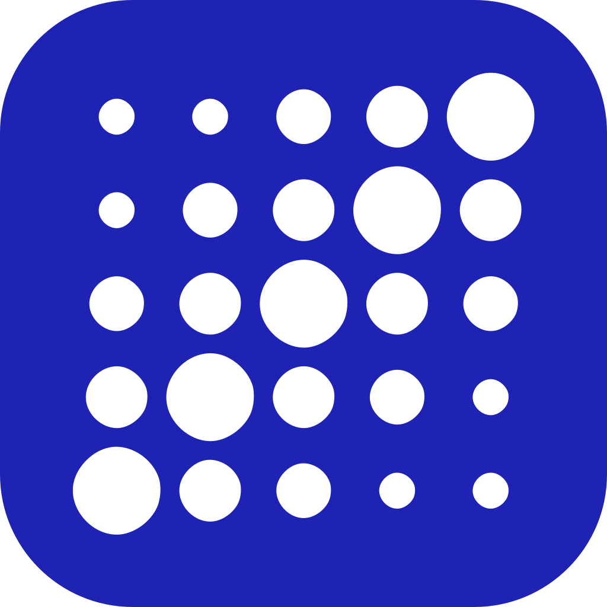
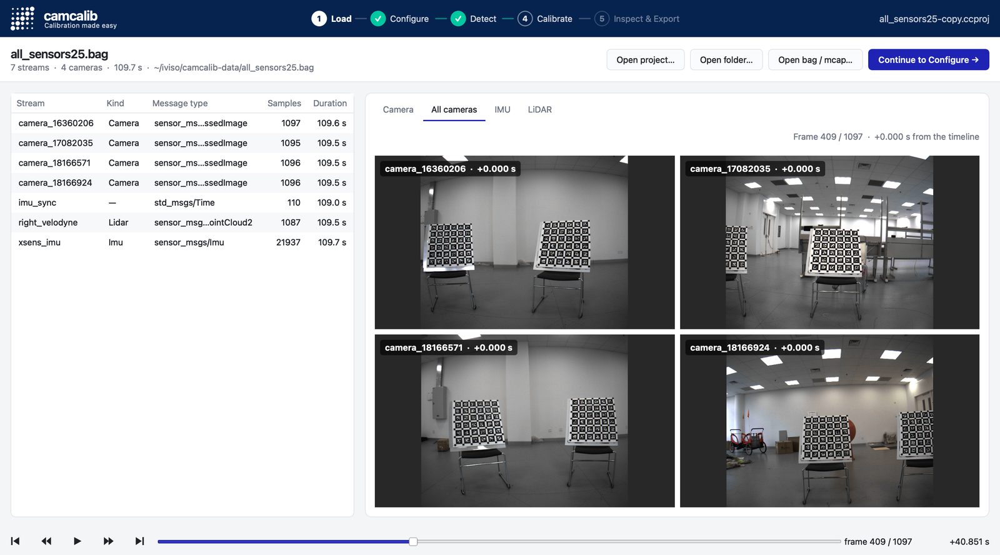

<p align="center">
  
</p>

<h1 align="center">camcalib</h1>

<p align="center"><b>Calibration made easy</b><br>
Cameras, LiDARs and IMUs, intrinsics and extrinsics, from one recording of a calibration board.</p>

<p align="center">
  <a href="https://github.com/IVISO/camcalib/releases"></a>
  
  
  
  <a href="https://www.camcalib.io"></a>
</p>

<p align="center">
  <a href="https://github.com/IVISO/camcalib/releases"><b>Download</b></a> ·
  <a href="#getting-started">Getting started</a> ·
  <a href="#recordings">Recordings</a> ·
  <a href="#calibration-boards">Boards</a> ·
  <a href="#camera-models">Camera models</a> ·
  <a href="#calibration-result">Result format</a> ·
  <a href="https://www.camcalib.io/plans-pricing">Pricing</a> ·
  <a href="https://www.camcalib.io/blog">Blog</a> ·
  <a href="https://github.com/IVISO/camcalib/issues">Issues</a>
</p>

<picture>
  <source media="(prefers-color-scheme: dark)" srcset="assets/app-load-dark.png">
  
</picture>

camcalib 2.0 is a desktop application for Ubuntu and Windows and a Python package. Open a
recording, describe the rig and the board, detect, calibrate, inspect, export.

| | |
|---|---|
| **Sensors** | any number of cameras, LiDARs and IMUs; synchronised or not, with time offsets estimated |
| **Recordings** | ROS 1 bags, MCAP, ROS 2 bags and plain folders, read without a ROS installation |
| **Boards** | AprilBoard, ChArUco, chessboard, chessboard with markers, random dots |
| **Camera models** | pinhole, radial-tangential (4, 5 or 8 coefficients), Kannala-Brandt fisheye, omnidirectional |
| **Results** | camcalib YAML with uncertainties, Kalibr, ROS camera_info, OpenCV, or a Python script that repeats the calibration |
| **Inspect** | residuals per frame and per corner, reprojection overlays, LiDAR plane errors, the rig in 3D, a live solve |

### Download

| file | what it is |
|---|---|
| `camcalib-app_2.0.0-1~ubuntu24.04_amd64.deb`, `…ubuntu26.04…` | the desktop application for Ubuntu 24.04 and 26.04 |
| `camcalib-app-2.0.0-windows-x64.msi` | the Windows installer (Program Files\camcalib, Start Menu entry) |
| `camcalib-app-windows-x64.zip` | the same application as a folder to unzip and run |
| `camcalib-2.0.0…-cp310-…whl`, `cp312`, `cp314` | the Python package for Ubuntu 22.04, 24.04 and 26.04 |

All of them are on the [releases page](https://github.com/IVISO/camcalib/releases).

## Getting started

### Desktop application

Ubuntu: `sudo apt install ./camcalib-app_2.0.0-1~ubuntu24.04_amd64.deb` (apt pulls in the Qt and
OpenCV libraries it needs), then start **camcalib** from the launcher or run `camcalib-app`.
Windows: run the MSI, or unzip the folder and start `camcalib-app.exe`.

A calibration is five stages, left to right across the top of the window. Each stage ends with
the button that leads to the next one; the circles in the stage bar lead back.

1. **Load**: open a recording (ROS 1 bag, MCAP, ROS 2 bag or folder, see [Recordings](#recordings)).
   Browse the cameras, the IMU plot and the point clouds on the timeline.
2. **Configure**: name the sensors, choose each camera's model, describe the calibration board,
   give each LiDAR a rough initial pose.
3. **Detect**: find the board in every image and look at the coverage.
4. **Calibrate**: solve, with the cost plot live and Cancel at hand.
5. **Inspect & Export**: residuals per frame and per corner, the reprojection overlay, the
   LiDAR plane errors, the rig in 3D, the parameters with their uncertainty; export the result
   as camcalib YAML, Kalibr, ROS camera_info or OpenCV FileStorage, or as a Python script that
   repeats the calibration on another recording of the same rig.

Everything is kept in a project file (`.ccproj`), so a calibration can be reopened, inspected and
recalibrated later. From the command line, `camcalib-app recording.bag` starts a project from a
recording and `camcalib-app rig.ccproj` opens one.

### License and free trial

Loading and browsing a recording work without a license; detection and calibration need one.
**Help → License…** holds everything about it:

- **Trial**: enter your email address and camcalib.io emails a link to confirm it, then a trial
  serial. The trial runs 7 days, once per email address, on one machine.
- **Activate** a serial (`ABCDE-FGHIJ-KLMNO-PQRST`), or an offline activation file (`.skm`) for a
  machine without internet access.
- The machines a serial is active on are listed there and can be deactivated, so a license moves
  with you to a new computer.

The same is available from Python through `camcalib_py.LicenseManager` (`request_trial`,
`activate_license`, `get_license_info`).

### Python package

Install the wheel that matches your Ubuntu release and its Python (3.10 on 22.04, 3.12 on 24.04,
3.14 on 26.04) and, if your own scripts iterate ROS bags with [rosbags](https://pypi.org/project/rosbags/),
that package too:

```bash
pip install camcalib-2.0.0*-cp312-*.whl
```

The shortest way to a working script is the app: **Inspect & Export → Export Python script…**
writes the open calibration as a stand-alone Python script with the sensors, the board, the
initial guess, the solver settings and the outlier rule filled in. Written by hand, a calibration
is:

```python
import camcalib

data = camcalib.calibration.CalibrationData()
data.set_target("AprilBoard", {"columns": 6, "rows": 6, "tag_size": 0.088, "tag_spacing": 0.3,
                               "marker_type": "A36h11"})
data.from_folder("recording/")          # or data.from_bag("recording.bag") for .bag, .mcap and ROS 2 bags

with camcalib.calibration.CalibratorSession() as cc:
    cc.add_calibration_data(data)
    # The initial guess: a result file with the camera models (and known values, if any).
    cc.add_calibration(camcalib.calibration.CalibrationResult.load("initial.yaml"))
    _, summary = cc.calibrate()
    cc.get_result().save("result.yaml")
```

where `initial.yaml` names each camera's model in the [result format](#calibration-result):

```yaml
sensors:
  /cam0:
    type: CAMERA
    intrinsics:
      type: PinholeRadTan4
      parameters: {image_size: [2064, 1544]}
```

The API reference ships with the wheel as `docs.tgz`.

## System requirements

| | |
|---|---|
| Desktop application | Ubuntu 24.04 or 26.04 (x86_64); Windows 10 or 11 (64-bit) |
| Python package | Ubuntu 22.04, 24.04 or 26.04 (x86_64) with the release's Python |
| Memory | 8 GB; more for long LiDAR recordings (the app keeps at most 300 LiDAR frames per sensor by default) |

## Recordings

camcalib reads, without a ROS installation:

- ROS 1 `.bag` files (uncompressed, bz2 or lz4 chunks)
- `.mcap` files (uncompressed, lz4 or zstd chunks)
- ROS 2 bag directories (`metadata.yaml` with sqlite3 or mcap storage, split bags)
- folders with one directory per sensor (below)

Message types: `sensor_msgs/Image`, `CompressedImage` (Bayer mosaics are demosaiced),
`CameraInfo`, `Imu`, `PointCloud2`, and the Livox `CustomMsg` of the ROS 1 and ROS 2 drivers.
Sensors are named after their topics, so a stream is `/cam0/image_raw` or `/livox/lidar`.

### Folder layout

Every directory without sub-directories is one sensor, named by its path below the root:

```
recording
├── cam0
│   ├── 1726239786_300000000.png
│   ├── 1726239786_400000000.png
│   └── ...
├── cam1
│   ├── 1726239786_300000000.png
│   └── ...
├── lidar
│   ├── 1726239786_312000000.pcd
│   └── ...
└── imu
    └── imu.csv
```

- **Images**: `.png`, `.jpg`, `.jpeg` or `.bmp`. The file name is the time of the image in seconds,
  with the fraction after `_`: `1726239786_300000000.png` is 1726239786.3 s, as is
  `1726239786_3.png`. A prefix ending in `-` is allowed (`cam0-1726239786_3.png`). Images that
  were taken at the same time must carry the same time in every camera's folder; that is how the
  streams are matched for an extrinsic calibration. Without times in the names the frames are
  numbered in file order, which is enough for an intrinsic calibration.
- **Point clouds**: `.pcd` files, named by time like the images.
- **IMU**: one `.csv` with the header `timestamp,gx,gy,gz,ax,ay,az`; the time in seconds, the
  gyroscope in rad/s, the accelerometer in m/s².
- **Videos** are not read. Export the frames as images, for example
  `ffmpeg -i cam0.mp4 cam0/%06d.png` for numbered frames.

### IMU

Accelerometer values are expected in m/s² and gyroscope values in rad/s. A recording whose
accelerometer reports g is scaled on import: the IMU's factor field on Configure (9.80665 for
such drivers, Livox among them), `accel_scale` in Python.

## Calibration boards

| board | settings | notes |
|---|---|---|
| **AprilBoard** | columns, rows, tag_size (m), tag_spacing (fraction of the tag size), marker_type `A16h5` `A25h9` `A36h10` `A36h11` | the [Kalibr](https://github.com/ethz-asl/kalibr/wiki/calibration-targets) Aprilgrid layout; the recommended board, robust to partial views |
| **CharucoBoard** | columns, rows, square_size (m), marker_size (m), marker_type `C4x4` `C5x5` `C6x6` `C7x7` or an AprilTag family | an [OpenCV ChArUco](https://docs.opencv.org/4.x/df/d4a/tutorial_charuco_detection.html) board |
| **ChessBoard** | columns, rows, square_size (m) | a plain chessboard; the whole board must be visible |
| **CcMarkerBoard** | columns, rows, square_size (m), marker_size (m), marker_type | a chessboard with four markers (ids 0 to 3) in its corner squares, which fix its orientation |
| **RandomDotBoard** | id, n, radius (m), width (m), height (m) | n random dots on a board of the given size; several boards with different ids can be used at once |

Ready to print, in this repository:

- [`aprilgrid/`](aprilgrid): AprilBoards of 6 × 6 and 12 × 6 tags (0.088 m, spacing 0.3, A36h11) as
  PDF and EPS, and `create_aprilboard.py` for other sizes.
- [`charuco_boards/`](charuco_boards): ChArUco boards of 5 × 7 squares with 6 × 6 ArUco markers
  (marker_type `C6x6`) for A4 to A0, and `create_charuco.py` for other sizes.
- A RandomDotBoard is written by the Python package:
  `camcalib.targets.RandomDotBoard(0, 50, 0.01, 1.0, 0.7).save_to_pdf("dots.pdf")`.

Print at 100 %, mount the sheet on something flat, and measure the printed tag or square: the
measured size goes into the settings, not the nominal one. The scripts print the matching
camcalib settings; `pip install -r requirements.txt` installs what they need.

For a LiDAR–camera calibration the board also has to be the flattest, most distinct plane near
where the cameras see it: camcalib finds the board in the point cloud as the plane that lies
where the cameras' detections predict it (the `PlaneDetector`), optionally helped by a strip of
reflective tape on the board for the initial LiDAR pose. The
[guide](https://www.camcalib.io/post/create-your-own-calibration-board) on camcalib.io has more
on building a board.

## Camera models

| type | parameters | for |
|---|---|---|
| `Pinhole` | fx, fy, cx, cy | cameras without distortion |
| `PinholeRadTan4` | fx, fy, cx, cy, k1, k2, p1, p2 | the common [OpenCV](https://docs.opencv.org/4.x/dc/dbb/tutorial_py_calibration.html) model: radial (k) and tangential (p) distortion |
| `PinholeRadTan5` | fx, fy, cx, cy, k1, k2, p1, p2, k3 | as above with a third radial term |
| `PinholeRadTan8` | fx, fy, cx, cy, k1, k2, p1, p2, k3, k4, k5, k6 | OpenCV's rational model |
| `KannalaBrandt` | fx, fy, cx, cy, k1, k2, k3, k4 | wide-angle and fisheye lenses ([OpenCV fisheye](https://docs.opencv.org/4.x/db/d58/group__calib3d__fisheye.html)) |
| `Omnidirectional` | fx, fy, cx, cy, k1, k2, p1, p2, xi | the unified omnidirectional model (Mei), for fisheye and catadioptric cameras |

fx, fy: focal length in pixels; cx, cy: principal point. `image_size` (width, height) is stored
with every camera. camcalib 1.x's `DoubleSphere` model is not in 2.0.

## Calibration result

The result is a YAML file with one entry per sensor under `sensors`. Each entry has a `type`
(`CAMERA`, `IMU` or `LIDAR`), the `intrinsics` of a camera (`type` is the camera model,
`parameters` its values and the image size) or an IMU (noise densities and the estimated biases),
and, after an extrinsic calibration, the `extrinsics`.

The extrinsics of a sensor $S_i$ are the pose $P_{S_i E}$ from the reference frame $E$ to the
sensor frame, as an axis-angle rotation and a translation: a point $x_E$ in the reference frame is
$x_{S_i} = R\,x_E + t$ in the sensor's frame. The pose between two sensors follows as

$$P_{S_1 S_0} = P_{S_1 E}\,P_{S_0 E}^{-1}.$$

The reference frame is the primary sensor's frame (chosen in Configure; the app's Parameters tab
can show the extrinsics relative to any other sensor), so the primary's extrinsics are the identity
and every other sensor's extrinsics are its pose relative to the primary. `dt` is the sensor's
clock offset against the reference in seconds, estimated for unsynchronised sensors when enabled.

<details>
<summary>A result file with two cameras, an IMU and a LiDAR</summary>

```yaml
sensors:
  /cam0:
    type: CAMERA
    intrinsics:
      type: PinholeRadTan4
      parameters:
        fx: 1398.21
        fy: 1397.87
        cx: 1021.43
        cy: 771.80
        k1: -0.0521
        k2: 0.0134
        p1: 0.0002
        p2: -0.0001
        image_size: [2064, 1544]
    extrinsics:
      axis_angle: [0, 0, 0]
      translation: [0, 0, 0]
      dt: 0
  /cam1:
    type: CAMERA
    intrinsics:
      type: KannalaBrandt
      parameters:
        fx: 701.12
        fy: 700.95
        cx: 1030.07
        cy: 768.44
        k1: 0.0213
        k2: -0.0041
        k3: 0.0007
        k4: -0.0001
        image_size: [2064, 1544]
    extrinsics:
      axis_angle: [0.0031, -0.5218, 0.0017]
      translation: [-0.2503, 0.0012, 0.0348]
      dt: 0
  /imu:
    type: IMU
    intrinsics:
      fps: 200
      noise: {std_g: 0.00017, std_a: 0.002, bias_g: 1.9e-05, bias_a: 0.0003}
      parameters:
        bias_g: [0.0012, -0.0004, 0.0009]
        bias_a: [0.021, 0.013, -0.045]
    extrinsics:
      axis_angle: [1.2092, -1.2092, 1.2092]
      translation: [0.0150, -0.0320, 0.0080]
      dt: 0.0021
  /lidar:
    type: LIDAR
    extrinsics:
      axis_angle: [0.0121, 1.5692, -0.0087]
      translation: [0.1021, 0.0034, -0.0812]
      dt: -0.0043
```

</details>

The app's **Export result…** also writes Kalibr (`camchain.yaml`, `camchain-imucam.yaml`, `imu.yaml`),
ROS `camera_info` (one YAML per camera) and OpenCV FileStorage files, each only for the camera
models the format can hold exactly. `scripts/rectify.py` rectifies a stereo pair from a result
with OpenCV, as a check of the extrinsics.

## Changes from camcalib 1.x

- A new desktop application with project files, a live solve and an Inspect stage; the AppImage
  is replaced by `.deb` packages for Ubuntu 24.04 and 26.04 and an MSI for Windows.
- A Python package per Ubuntu release, with the same readers and detectors as the app.
- LiDAR–camera and camera–IMU calibration, time offsets, and MCAP and ROS 2 recordings.
- Recordings are read without ROS. Videos are not read any more; export the frames.
- The `DoubleSphere` camera model is gone. 1.x result files still load; their `PinholeRadTan` is
  read as `PinholeRadTan8` with the extra coefficients zero. The circle-grid board generator of 1.8 is gone, as no 2.0 board reads it.
- Live capture from IDS uEye cameras is not part of 2.0; record first, then calibrate.
- The trial is requested by email from the License dialog and runs 7 days.

## Bugs and features

Problems and feature requests go to the [issues page](https://github.com/IVISO/camcalib/issues);
for anything else, [info@camcalib.io](mailto:info@camcalib.io).
